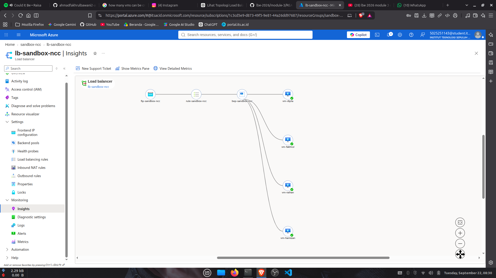

# LBE NCC TEAM 09

Daftar isi:

1. Arsitektur Aplikasi
2. Arsitektur Cloud

## Arsitektur Aplikasi

1. Arsitektur aplikasi kami mengembangkan website html, css, vanilla js yang disimpan pada direktori [app](./app/). Struktur direktori bisa dilihat pada snippet berikut:

```bash
├── app
│   ├── dipta
│   │   ├── data.json
│   │   ├── index.html
│   │   ├── script.js
│   │   └── style.css
│   ├── Dockerfile
│   ├── entrypoint.sh
│   ├── fakhrul
│   │   ├── db
│   │   ├── index.html
│   │   ├── public
│   │   ├── script.js
│   │   └── style.css
│   ├── hamizan
│   │   ├── css
│   │   └── index.html
│   ├── nginx.conf
│   └── raihan/
```

2. Kemudian kami membangun satu docker image dengan base image nginx dengan entrypoint menggunakan [entrypoint.sh](./app/entrypoint.sh) untuk menghandle runtime environment variable injection.

```Dockerfile
FROM nginx:alpine

# aku mau workspace disimpan di /app karena defaultnya di root server /usr/share/nginx/html
WORKDIR /app

# copy semua isi app/ yaitu di cwd kecuali yang terlist di .dockerignore
COPY . .

# hapus default config nginx dari base image
RUN rm -f /etc/nginx/conf.d/default.conf

# ganti dengan nginx.conf kita sendiri
RUN mv /app/nginx.conf /etc/nginx/nginx.conf

# kasih permission execute
RUN chmod +x /app/entrypoint.sh

EXPOSE 8080

ENTRYPOINT ["/app/entrypoint.sh"]
```

3. Kemudian untuk handle env injection kami menggunakan variable `VM_HOSTNAME` untuk mengetahui hostname virtual machine saat ini untuk menyalin project website yang sesuai ke server nginx di `/usr/share/nginx/html`.

```bash
#!/bin/sh

set -e

SAFE_HOSTNAME=$(printf '%s' "${VM_HOSTNAME:-unknown}" | tr -cd 'A-Za-z0-9-')

if [ -z "$SAFE_HOSTNAME" ]; then
    SAFE_HOSTNAME="unknown"
fi

case "$VM_HOSTNAME" in
    fakhrul)
        cp -r /app/fakhrul/* /usr/share/nginx/html/
        ;;

    dipta)
        cp -r /app/dipta/* /usr/share/nginx/html/
        ;;

    hamizan)
        cp -r /app/hamizan/* /usr/share/nginx/html/
        ;;

    raihan)
        cp -r /app/raihan/* /usr/share/nginx/html/
        ;;

    *)
        echo "Unknown VM_HOSTNAME: $VM_HOSTNAME"
        exit 1
        ;;
esac

echo "Starting Azure LB demo sandbox, whoami injected as: ${SAFE_HOSTNAME}"

exec nginx -g "daemon off;"
```

Dapat dilihat jika hostnamenya `fakhrul` maka kita copy folder [fakhrul](./app/fakhrul/) ke server nginx. Kenapa menggunakan `cp` dan tidak menggunakan `mv`? Karena kami ingin menjaga integritas source code project di tiap virtual machine, apabila menggunakan `mv` maka akan berdampak pada salah satu projek menghilang karena dipindah ke server nginx.

4. Untuk konfigurasi nginx sendiri standar saja sebagai berikut:

```conf
# kasih worker otomatis menyesuaikan resource vm
worker_processes auto;

# events mengatur bagaimana Nginx menangani koneksi
events {
    # maksimal koneksi yang dapat ditangani oleh setiap worker secara bersamaan
    worker_connections 1024;
}

# config http servernya nginx
http {
    # MIME type identifier
    include       /etc/nginx/mime.types;
    # MIME type default apabila nginx tidak mengetahui tipe file yang diminta, application/octet-stream basically menganggap ini file biasa bukan file khusus
    default_type  application/octet-stream;
    # aktivasi fitur sendfile
    sendfile      on;

    # virtual server setup nginx
    server {
        # port yang dijalankan di 8080, sama dengan Dockerfile
        listen 8080;
        #  server name defaultnya _
        server_name _;

        # ini root directory atau workspacenya server html si nginx, kita harus save website index.html di sini
        root /usr/share/nginx/html;
        # file default yang dibuka ketika client call api GET /
        index index.html;

        location / {
            # jika request client tidak ditemukan, maka set status code 404 not found
            try_files $uri $uri/ =404;
        }
    }
}
```

5. Untuk menjalankannya dapat dilakukan dengan 2 cara, yaitu lokal dan production. Untuk bagian arsitektur aplikasi kami hanya membahas run lokal saja, untuk run production dijelaskan di bagian arsitektur cloud. Berikut tahapan menjalankan di lokal:
   1. Fix docker permission dengan menambah usernamemu (hanya lakukan jika belum pernah)

   ```bash
   sudo usermod -aG docker $USER
   newgrp docker
   ```

   2. Build docker images

   ```bash
   cd app/
   docker build --tag ncc-team-09 ./
   ```

   3. Buat dan run docker container dengan inject `env` bernama `VM_HOSTNAME` sesuaikan dengan daftar di [entrypoint.sh](./app/entrypoint.sh). Lalu jalankan di port yang berbeda karena device hanya satu. Nanti di production kita akan run di port yang sama.

   web-1: in your `localhost:8080`

   ```bash
   docker run \
       --detach \
       --publish 8080:8080 \
       --env VM_HOSTNAME="<your_vm_hostname>" \
       --name <your_vm_hostname>-web \
       ncc-team-09
   ```

   web-2: in your `localhost:8081`

   ```bash
   docker run \
       --detach \
       --publish 8081:8080 \
       --env VM_HOSTNAME="<your_vm_hostname>" \
       --name <your_vm_hostname>-web \
       ncc-team-09
   ```

   Dan seterusnya. Maka seharusnya tiap projek akan muncul di port yang sesuai.

## Arsitektur Cloud

Cloud menggunakan Azure dengan load balancer yang diatur untuk melakukan load balancing resource ke 4 virtual machine seperti ini:



Langkah pembuatan:

1. Buat resource group di region `India South Central`. Kenapa di region tersebut? Karena di akun Azure for Student memiliki limit 4vCPU dalam 1 region / resource group. Sehingga satu VM harus menggunakan 1vCPU untuk bisa membuat 4 VM tiap anggota.
2. Buat Virtual Network IPv4 untuk resource group tersebut. Virtual network akan membuat jaringan lokal (LAN) beserta subnet-subnetnya secara virtual. Nama virtual network ini biasanya `10.0.0.0/16`
3. Buat 2 IP address untuk ssh VM master (mari sebut saja vm fakhrul) dan IP Address untuk load balancer.
4. Buat VM fakhrul dan pasangkan IP address yang telah dibuat tadi. Lalu set virtual network dengan virtual network yang sudah dibuat tadi. Jangan lupa untuk set sizenya ke 1vCPU. Pilihan yang ada adalah `B1s`. Authentikasi gunakan ssh key agar cepat.
5. Buat lagi 3 VM untuk setiap anggota tapi set IP ke private dari virtual network resource group. Ini berarti kita akan menggunakan subnet di dalam virtual network yang dibuat secara otomatis tiap kali kita membuat VM baru. Biasanya `10.0.0.5`, `10.0.0.6`, dst. Dimana angka terakhir adalah nama subnet tiap VM. Lalu untuk authentikasinya gunakan password saja supaya tidak perlu simpan ssh key di dalam VM master. Kita beri nama hamizan, raihan, dan dipta.
6. Untuk semua VM tambahkan inbound port rule 8080 allowed agar server bisa berjalan di port tersebut.
7. Lakukan instalasi docker, docker build dan run docker container di tiap VM. Ikuti langkah berikut:

   Pada VM fakhrul:
   1. Clone repo projek ke VM fakhrul

   ```bash
   mkdir ~/ncc-team-09-lbe-final
   git clone https://github.com/ahmadfakhrulbawani2-arch/ncc-team-09-lbe-final.git ~/ncc-team-09-lbe-final
   ```

   2. Download docker dan buat folder untuk menampung semua file packagenya

   ```bash
   sudo apt-get update
   sudo apt-get install -y ca-certificates curl gnupg
   sudo install -m 0755 -d /etc/apt/keyrings
   curl -fsSL https://download.docker.com/linux/ubuntu/gpg | sudo gpg --dearmor -o /etc/apt/keyrings/docker.gpg
   sudo chmod a+r /etc/apt/keyrings/docker.gpg

   echo \
     "deb [arch=$(dpkg --print-architecture) signed-by=/etc/apt/keyrings/docker.gpg] https://download.docker.com/linux/ubuntu \
     $(. /etc/os-release && echo $VERSION_CODENAME) stable" | \
     sudo tee /etc/apt/sources.list.d/docker.list > /dev/null

   sudo apt-get update

   mkdir -p ~/docker-offline-debs
   sudo apt-get clean
   sudo apt-get install -y --download-only \
     docker-ce docker-ce-cli containerd.io docker-buildx-plugin docker-compose-plugin
   cp /var/cache/apt/archives/*.deb ~/docker-offline-debs/
   sudo usermod -aG docker $USER
   newgrp docker
   ```

   3. Build docker image lalu save dan arsipkan ke dalam tape archive file

   ```bash
   # navigate to app/
   cd ~/ncc-team-09-lbe-final/app
   docker build -t ncc-team-09 ./
   docker save ncc-team-09 -o ~/ncc-team-09.tar
   ```

   4. Copy arsipan docker image dan dependensi docker ke 3 VM lainnya:

   ```bash
   ssh <username>@<vm_ip> "mkdir -p ~/docker-offline-debs"
   scp ~/docker-offline-debs/*.deb <username>@<vm_ip>:~/docker-offline-debs/
   scp ~/ncc-team-09.tar <username>@<vm_ip>:~/
   ```

   5. Login ke 3 VM tersebut lalu jalankan perintah install docker dan load docker image. Lakukan di semua VM:

   ```bash
   ssh <username>@<vm_ip>

   # install docker
   cd ~/docker-offline-debs
   sudo dpkg -i *.deb
   sudo systemctl enable --now docker
   sudo usermod -aG docker $USER
   newgrp docker

   # create and run docker container
   docker load -i ~/ncc-team-09.tar
   ```

   6. Terakhir ulangi langkah ini di semua VM, yaitu run docker containernya:

   ```bash
   docker run -d \
      --name <vm_hostname>-web \
      -p 8080:8080 \
      -e VM_HOSTNAME="<nama_hostname>" \
      ncc-team-09
   ```

   7. Cek server dengan curl. Untuk 3 VM selain fakhrul lakukan curl di VM fakhrul seperti ini:

   ```bash
   sudo apt install curl
   curl -s http://<vm_ip>:8080 | head -100
   ```

   Seharusnya akan tampil isi `index.html` di console. Ulangi untuk tiap VM. Lalu untuk cek milik fakhrul bisa dilakukan di host perangkat kita:

   ```bash
   curl -s http://<vm_public-ip>:8080 | head -100
   ```

8. Selanjutnya kita buat load balancernya agar setiap kali kita access ip address atau domain name dari public ip kita mengalokasikan resource di VM yang berbeda sehingga akan muncul tampilan web yang berbeda pula. Ada beberapa bagian load balancer yang harus diperhatikan sebagai berikut:
   1. Set load balancer ke public dan sesuaikan region dengan resource group.
   2. Set front-end IP dengan public IP yang kita buat sebelumnya. Settingan lainnya dibiarkan default.
   3. Set inbound port rule dengan `port: 80`, backend port `8080` lalu buat juga health probe set port ke `8080`. Settingan lainnya dibiarkan default
   4. Buat backend pool dan tambahkan semua VM. Jangan lupa untuk set admin state di `NONE` agar load balancer membiarkan health probe bekerja di VM tersebut.
   5. Review + create. Membutuhkan ~10 menit untuk deploy load balancer sepenuhnya ke cloud dan membutuhkan ~30-45 menit untuk load balancer bisa bekerja dengan stabil. Untuk mengeceknya bisa buka ip public load balancer di perangkat kita.

9. Bukti:

Video demo: [disini](./docs/2026-09-22%2009-27-59.mp4) <br />
Sayangnya untuk for loop curl tidak dapat dilakukan karena kami hanya mengalokasikan 1vCPU tiap VM sehingga tidak mampu menghandle request tersebut ditambah lagi kami mendeploy di region India sehingga selalu membuat time out request curl. Dokumentasi lain disimpan [disini](./docs/)
