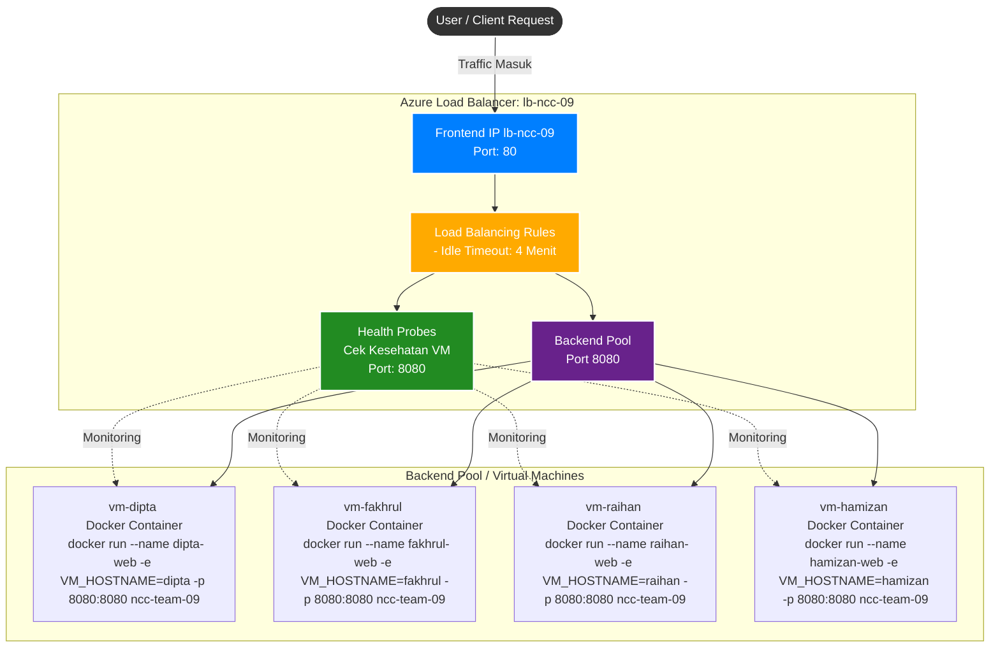

# APP ARCHITECTURE OVERVIEW

```mermaid
graph TD
    %% Client & Frontend
    Client([User / Client Request]) -->|Traffic Masuk| FIP[Frontend IP lb-ncc-09 <br /> Port: 80]

    %% Load Balancer Core Components
    subgraph lb_sandbox_ncc [Azure Load Balancer: lb-ncc-09]
        FIP --> LBR[Load Balancing Rules <br/> - Idle Timeout: 4 Menit]
        LBR --> HP[Health Probes <br/> Cek Kesehatan VM <br/> Port: 8080]
        LBR --> BP[Backend Pool <br/> Port 8080]
    end

    %% Backend VMs (Sesuai Screenshot)
    HP -.->|Monitoring| VM1
    HP -.->|Monitoring| VM2
    HP -.->|Monitoring| VM3
    HP -.->|Monitoring| VM4

    subgraph backend_pool [Backend Pool / Virtual Machines]
        BP --> VM1[vm-dipta <br/> Docker Container <br/> docker run --name dipta-web -e VM_HOSTNAME=dipta -p 8080:8080 ncc-team-09]
        BP --> VM2[vm-fakhrul <br/> Docker Container <br/> docker run --name fakhrul-web -e VM_HOSTNAME=fakhrul -p 8080:8080 ncc-team-09]
        BP --> VM3[vm-raihan <br/> Docker Container <br/> docker run --name raihan-web -e VM_HOSTNAME=raihan -p 8080:8080 ncc-team-09]
        BP --> VM4[vm-hamizan <br/> Docker Container <br/> docker run --name hamizan-web -e VM_HOSTNAME=hamizan -p 8080:8080 ncc-team-09]
    end

    %% Styling
    style Client fill:#333,stroke:#fff,stroke-width:2px,color:#fff
    style FIP fill:#007fff,stroke:#fff,stroke-width:2px,color:#fff
    style LBR fill:#ffaa00,stroke:#fff,stroke-width:2px,color:#fff
    style HP fill:#228b22,stroke:#fff,stroke-width:2px,color:#fff
    style BP fill:#68228b,stroke:#fff,stroke-width:2px,color:#fff
```
